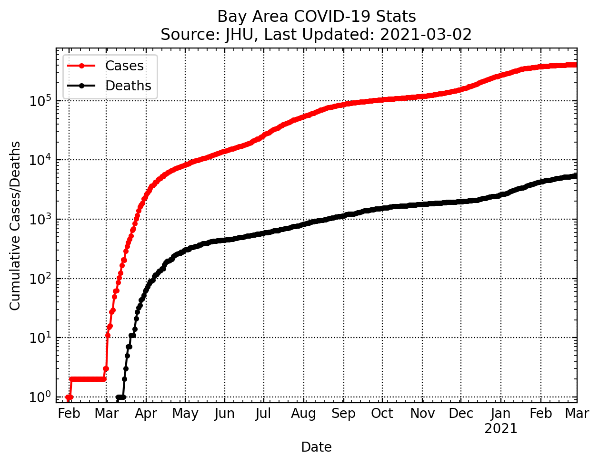
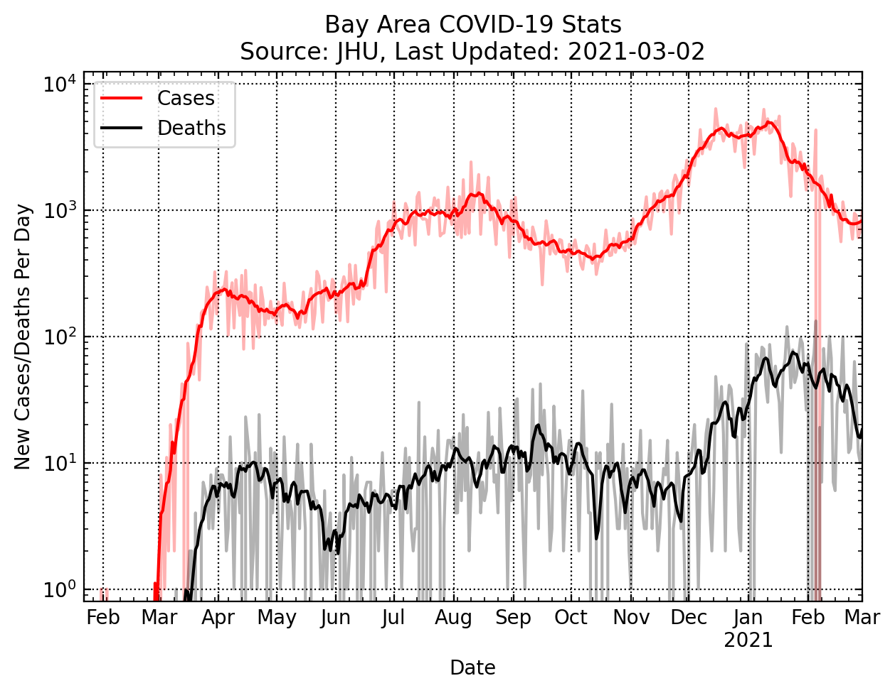
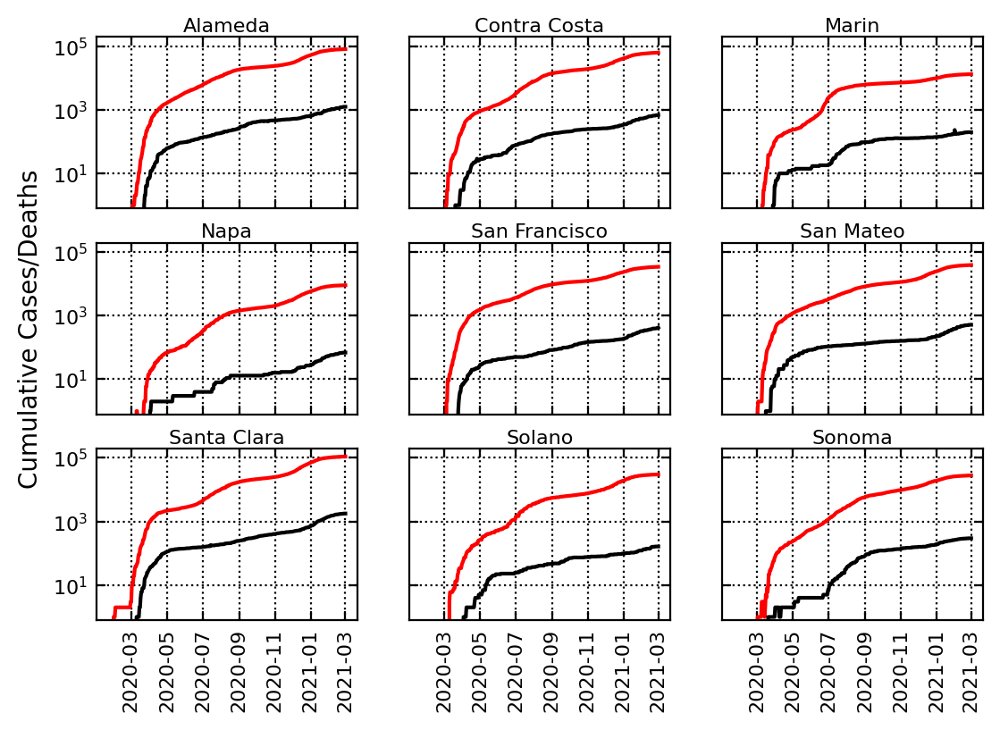
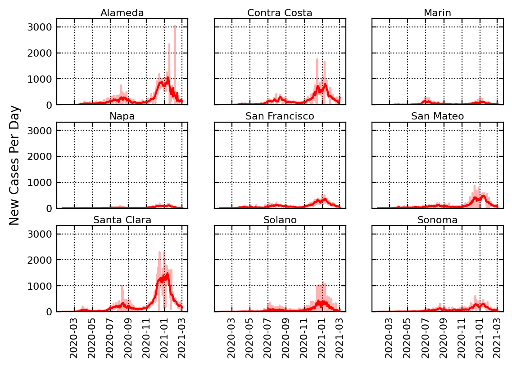
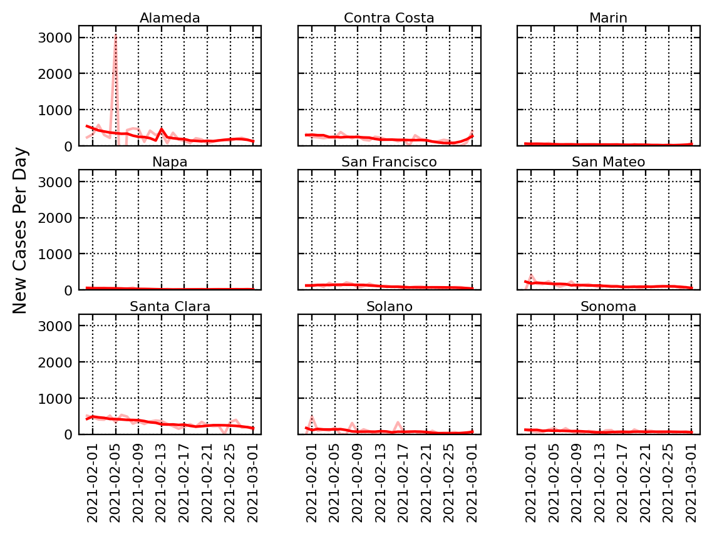

# Bay Area COVID-19 Dashboard
A repo for plotting and analyzing COVID-19 cases, with a focus on the bay area.

## Current Bay Area Numbers

Below, we show the total, cumulative cases (and deaths) over time for the combined 9 bay area counties.

Below, we show the daily new cases (and deaths) over time for the combined 9 bay area counties.

## County-by-County Numbers

Below, we show the total, cumulative cases (and deaths) over time for each of the 9 bay area counties.

Below, we show the daily new cases cases over time for each of the 9 bay area counties.

Below, we show the daily new cases cases over the last month for each of the 9 bay area counties.

